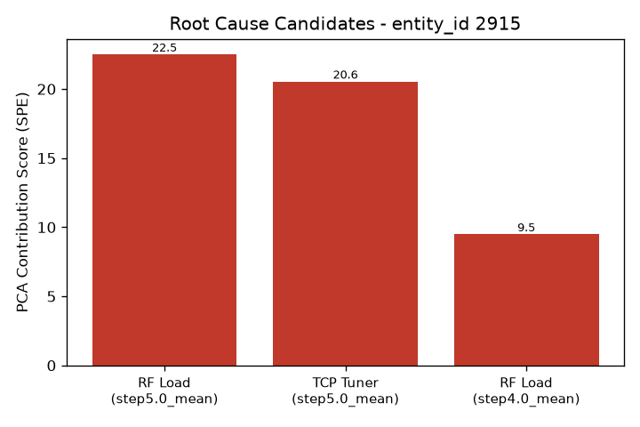

# 알람 조사 보고서 - entity_id 2915

- 생성 시각: 2026-09-11 23:02:44
- 사용 모델: us.anthropic.claude-sonnet-4-6 (AWS Bedrock)

모든 정보를 수집했습니다. 아래에 최종 보고서를 작성합니다.

---

# LAM 9600 이상 알람 조사 보고서

> **장비:** LAM 9600 플라즈마 에칭 장비
> **대상 웨이퍼:** entity_id **2915**
> **분석 방법:** PCA 기반 이상탐지 엔진 (기여도 점수 기준 상위 3개 후보 도출)

---

## 알람 요약

entity_id **2915번 웨이퍼**에서 이상 알람이 발생하였습니다. PCA 기반 이상탐지 엔진으로 분석한 결과, **RF Load**와 **TCP Tuner** 두 변수가 높은 기여도 점수를 보이며 이상의 원인 후보로 식별되었습니다. 이는 확정된 원인이 아니며, 최종 판단은 반드시 공정 엔지니어가 수행해야 합니다.

---

## 원인후보 (근거 포함)

| 순위 | 변수 | 세부 항목 | 기여도 점수 |
|:---:|---|---|:---:|
| 1 | **RF Load** | step5.0_mean (5단계 평균값) | **22.51** |
| 2 | **TCP Tuner** | step5.0_mean (5단계 평균값) | **20.55** |
| 3 | **RF Load** | step4.0_mean (4단계 평균값) | **9.49** |

**주요 관찰 사항:**

- **1순위 RF Load (step5.0)** 와 **2순위 TCP Tuner (step5.0)** 는 기여도 점수가 각각 22.51, 20.55로 근소한 차이를 보이며, **공정 step5 구간에서 두 변수가 동시에 이상 거동**을 보인 것으로 추정됩니다.
- **3순위 RF Load (step4.0)** 는 기여도 9.49로 상대적으로 낮지만, step4에서도 RF Load 이상이 선행했을 가능성을 배제할 수 없습니다.
- RF Load가 1위와 3위에 중복 등장한다는 점은 **RF Load 관련 계통의 지속적 이상**을 시사할 수 있습니다.

---

## 참고 배경지식 (AI 합성 지식, 검증 필요)

> ⚠️ **주의:** 아래 내용은 AI가 정리한 **일반 반도체 공정 지식**이며, 이 장비(LAM 9600)의 검증된 사내 매뉴얼이 아닙니다. 참고용으로만 활용하시고, 모든 판단은 공정 엔지니어가 실제 장비 매뉴얼과 이력을 바탕으로 확인하시기 바랍니다.

### 🔷 RF Load (바이어스 RF 계열)
- **역할:** 웨이퍼가 놓인 척(chuck) 쪽에 인가되는 전력으로, 이온이 웨이퍼 표면에 충돌하는 에너지(이온 바이어스)를 조절합니다. TCP 전원계와는 독립적인 별개의 전원계입니다.
- **흔한 원인:** 바이어스 RF 발생기 이상, 척-웨이퍼 간 접촉 불량
- **주요 증상:** 식각 선택비 및 프로파일(측면 각도) 변화, 과도 인가 시 웨이퍼 손상 위험

### 🔷 TCP Tuner (Transformer Coupled Plasma 계열)
- **역할:** 챔버 상부 코일에 고주파 전력을 인가하여 플라즈마를 생성하는 시스템으로, 플라즈마 밀도와 라디칼 생성량을 결정합니다.
- **흔한 원인:** RF 발생기 출력 드리프트, 임피던스 매칭 네트워크 튜닝 불량, 코일 노후화
- **주요 증상:** 식각 속도 변화, 웨이퍼 표면 균일도(uniformity) 저하, 전력 과잉 시 과식각 / 전력 부족 시 식각 불량

---

## 다음 조치 제안 (공정 엔지니어 확인 필요)

> 아래는 배경 지식에 기반한 조사 방향 제안이며, 실제 조치 여부와 우선순위는 **공정 엔지니어가 최종 판단**해 주십시오.

1. **Step4 → Step5 구간 데이터 상세 검토**
   - RF Load와 TCP Tuner의 실제 트렌드 차트를 확인하여 이상이 시작된 정확한 시점과 패턴을 파악하십시오.

2. **바이어스 RF 발생기 및 척-웨이퍼 접촉 상태 점검**
   - RF Load가 1, 3순위에 중복 등장하므로, 바이어스 RF 발생기 출력 및 척 상태(이물질, 접촉 불량 여부)를 우선적으로 확인하십시오.

3. **TCP 임피던스 매칭 네트워크 및 코일 상태 확인**
   - TCP Tuner의 튜닝 로그 및 반사 전력(reflected power) 이력을 확인하고, 코일 노후화 여부를 점검하십시오.

4. **인접 웨이퍼 및 동일 챔버 이력 검토**
   - 2915번 전후 웨이퍼들의 데이터와 해당 챔버의 PM(예방 정비) 이력을 비교하여 간헐적 현상인지 추세적 열화인지 파악하십시오.

5. **실물 웨이퍼 검사**
   - 식각 프로파일, 선택비, 균일도 등 실제 공정 결과물을 계측하여 알람과의 상관성을 검증하십시오.

---

*본 보고서는 PCA 기반 이상탐지 엔진과 AI 합성 지식을 바탕으로 작성된 초기 조사 참고 자료입니다. 원인의 최종 확정 및 조치 결정은 반드시 