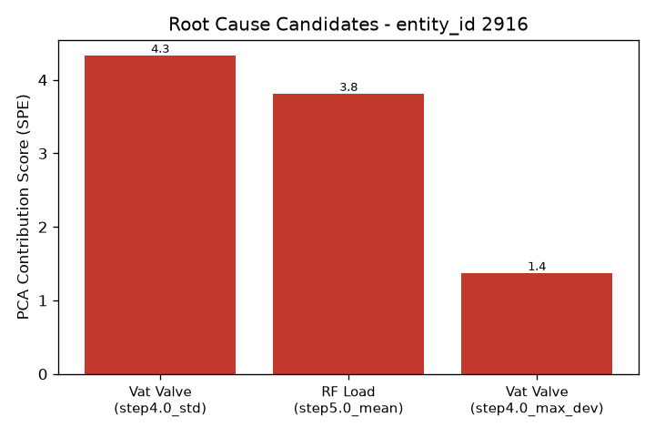

# 알람 조사 보고서 - entity_id 2916

- 생성 시각: 2026-09-11 23:01:19
- 사용 모델: us.anthropic.claude-sonnet-4-6 (AWS Bedrock)

모든 데이터가 수집되었습니다. 종합 보고서를 작성하겠습니다.

---

# 🔔 이상 알람 조사 보고서 — 웨이퍼 #2916 (LAM 9600)

> **⚠️ 주의:** 본 보고서는 PCA 기반 이상탐지 엔진의 통계적 분석과 AI 합성 일반 지식을 바탕으로 작성된 **참고용 보조 자료**입니다. 원인 확정 및 최종 판단은 반드시 **공정 엔지니어**가 수행해야 합니다.

---

## 알람 요약

| 항목 | 내용 |
|------|------|
| 웨이퍼 ID | 2916 |
| 장비 | LAM 9600 (플라즈마 에칭) |
| 분석 방법 | PCA 기반 이상탐지 (기여도 스코어 순위) |
| 원인 후보 수 | 3개 (변수 2종) |

---

## 원인후보 (근거 포함)

PCA 이상탐지 엔진이 반환한 기여도 스코어 기준 상위 3개 후보는 다음과 같습니다.

| 순위 | 변수명 | 세부 항목 | 기여도 스코어 |
|------|--------|-----------|--------------|
| 1위 | **Vat Valve** | step4.0 구간 표준편차 (std) | **4.33** |
| 2위 | **RF Load** | step5.0 구간 평균값 (mean) | **3.81** |
| 3위 | **Vat Valve** | step4.0 구간 최대편차 (max_dev) | **1.37** |

### 주목 포인트
- **Vat Valve**가 1위(std)와 3위(max_dev)로 **두 지표에서 동시에** 이상 신호를 보이고 있어, 해당 변수의 이상 가능성에 주목할 필요가 있습니다. 특히 step4.0 구간에서 변동폭(표준편차·최대편차)이 비정상적으로 크다는 점이 특징입니다.
- **RF Load** 역시 step5.0 구간의 평균값 기여도가 높아 두 번째 주요 후보로 분류됩니다.

---

## 참고 배경지식 (AI 합성 지식, 검증 필요)

> **⚠️ 아래 내용은 AI가 정리한 일반 반도체 공정 지식이며, 이 장비(LAM 9600)의 검증된 사내 매뉴얼이 아닙니다. 반드시 공식 매뉴얼 및 공정 엔지니어의 확인을 거쳐 활용하시기 바랍니다.**

### 🔴 Vat Valve (1위, 3위)
- **참고 배경지식 조회 결과: 정보 없음**
- 해당 변수에 대한 배경 지식을 데이터베이스에서 찾을 수 없었습니다. Vat Valve는 챔버 내 압력 제어와 관련된 가변 컨덕턴스 밸브로 알려져 있으나, **본 보고서에서는 검증되지 않은 정보를 임의로 기재하지 않습니다.** 사내 매뉴얼 또는 장비 제조사(LAM Research) 기술 문서를 직접 참조하시기 바랍니다.

### 🟡 RF Load (2위)
- **역할:** 웨이퍼가 놓인 척(chuck) 쪽에 걸리는 전력으로, 이온이 웨이퍼 표면에 충돌하는 에너지(이온 바이어스)를 조절하는 역할. TCP 전원계와는 별개의 전원계.
- **흔한 원인:** 바이어스 RF 발생기 이상, 척-웨이퍼 접촉 불량
- **증상:** 식각 선택비·프로파일(측벽 각도) 변화, 과도한 경우 웨이퍼 손상 위험

---

## 다음 조치 제안 (공정 엔지니어 확인 필요)

아래 조치는 통계적 분석과 일반 지식에 기반한 **제안 사항**이며, 실제 수행 여부와 순서는 공정 엔지니어가 판단해야 합니다.

1. **[Vat Valve — 최우선 확인]**
   - step4.0 구간의 Vat Valve 트렌드 로그 및 파형을 직접 확인하여 변동 원인 규명
   - 밸브 기계적 상태(오염, 마모, 구동부 이상 등) 점검
   - 동일 챔버의 최근 PM(예방정비) 이력 검토

2. **[RF Load — 추가 확인]**
   - step5.0 구간 RF Load 평균값의 정상 범위 대비 이탈 여부 확인
   - 바이어스 RF 발생기 및 매칭 네트워크 상태 점검
   - 척-웨이퍼 접촉 상태 및 ESC(정전척) 관련 파라미터 확인

3. **[공통 조치]**
   - 동일 챔버에서 전후로 처리된 인접 웨이퍼들의 공정 결과(CD, 프로파일 등) 비교
   - 해당 알람 이전 챔버의 압력·가스 흐름 로그 전반적 이상 여부 검토
   - 필요 시 장비 제조사(LAM Research) 기술 지원 요청

---

**보고서 작성:** 반도체 플라즈마 에칭 장비 이상 알람 분석 보조 엔지니어 (AI)
**최종 판단 및 조치:** 담당 공정 엔지니어 확인 필수