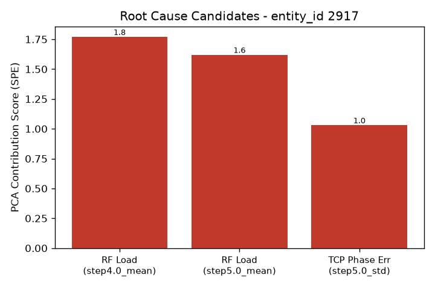

# 알람 조사 보고서 - entity_id 2917

- 생성 시각: 2026-09-11 23:01:47
- 사용 모델: us.anthropic.claude-sonnet-4-6 (AWS Bedrock)

모든 정보가 수집되었습니다. 아래에 보고서를 작성합니다.

---

## 알람 요약

| 항목 | 내용 |
|---|---|
| **장비** | LAM 9600 (플라즈마 에칭 장비) |
| **웨이퍼 ID** | 2917 |
| **분석 방법** | PCA 기반 이상탐지 엔진 |
| **이상후보 변수 수** | 2종 (RF Load, TCP Phase Err) |

이상탐지 엔진이 2917번 웨이퍼의 센서 데이터를 분석한 결과, 공정 Step 4~5 구간에서 **RF Load** 및 **TCP Phase Err** 관련 변수들이 높은 기여도를 보이며 이상 신호로 감지되었습니다.

---

## 원인후보 (근거 포함)

> ⚠️ 아래 순위는 PCA 기반 이상탐지 엔진이 산출한 **가능성 후보**이며, 원인이 확정된 것이 아닙니다. 최종 원인 판단은 반드시 공정 엔지니어가 직접 확인하여야 합니다.

| 순위 | 변수 | 세부 항목 | 기여도 점수 |
|---|---|---|---|
| 1위 | **RF Load** | step4.0_mean (Step 4 평균값) | 1.77 |
| 2위 | **RF Load** | step5.0_mean (Step 5 평균값) | 1.62 |
| 3위 | **TCP Phase Err** | step5.0_std (Step 5 표준편차) | 1.03 |

**종합 해석:**
- **RF Load**가 1위와 2위를 모두 차지하며, Step 4와 Step 5 전반에 걸쳐 평균값이 정상 범위를 벗어난 것으로 분석됩니다. RF Load는 웨이퍼 척(chuck) 측의 바이어스 전력과 직결되므로, 이온 에너지 제어에 직접적인 영향을 줄 수 있습니다.
- **TCP Phase Err**는 Step 5에서 표준편차가 높게 나타났습니다. TCP 전력의 위상 오차가 불안정했음을 의미하며, 플라즈마 생성의 불균일 가능성을 시사합니다.
- 두 변수 모두 Step 5에서 동시에 이상 징후를 보이는 점은 주목할 만하며, **Step 5 구간에서 RF 계통 전반의 이상**이 있을 가능성을 고려할 필요가 있습니다.

---

## 참고 배경지식 (AI 합성 지식, 검증 필요)

> ⚠️ 아래 내용은 **AI가 정리한 일반 반도체 공정 지식**이며, 이 장비(LAM 9600)의 검증된 사내 매뉴얼이나 공식 문서가 아닙니다. 참고 목적으로만 활용하시고, 실제 조치 전에 반드시 사내 매뉴얼 및 전문 엔지니어의 확인을 거치시기 바랍니다.

### 🔹 RF Load (바이어스 RF, 웨이퍼 척 측)
- **역할:** 웨이퍼가 놓인 척 쪽에 걸리는 전력으로, 이온이 웨이퍼 표면에 충돌하는 에너지(이온 바이어스)를 조절합니다. TCP와는 독립된 별개의 전원계입니다.
- **흔한 원인:** 바이어스 RF 발생기 이상, 척-웨이퍼 접촉 불량
- **증상:** 식각 선택비 및 프로파일(측벽 각도) 변화, 과도 시 웨이퍼 손상 위험

### 🔹 TCP Phase Err (Transformer Coupled Plasma 계열)
- **역할:** 챔버 상부 코일에 고주파 전력을 인가하여 플라즈마를 생성하는 시스템으로, 플라즈마 밀도와 라디칼 생성량을 결정합니다.
- **흔한 원인:** RF 발생기 출력 드리프트, 임피던스 매칭 네트워크 튜닝 불량, 코일 노후화
- **증상:** 식각 속도 변화, 웨이퍼 표면 균일도 저하, 전력 과도 시 과식각 / 부족 시 식각 부족

---

## 다음 조치 제안 (공정 엔지니어 확인 필요)

> ⚠️ 아래 조치 사항은 분석 결과 및 일반 배경지식에 기반한 **제안**입니다. 실제 조치 여부 및 우선순위는 공정 엔지니어의 판단에 따라 결정되어야 합니다.

1. **RF Load 이력 점검**
   - Step 4, Step 5 구간의 RF Load 트렌드를 최근 웨이퍼들과 비교하여 이상 편차 여부를 확인하세요.
   - 바이어스 RF 발생기의 출력 로그 및 매칭 네트워크 상태를 점검하세요.
   - 척-웨이퍼 접촉면의 이물질 또는 소모품 상태(e-chuck 등)를 육안 및 계측으로 확인하세요.

2. **TCP Phase Err 점검**
   - Step 5 구간에서 TCP 위상 오차의 진폭 및 패턴을 분석하세요.
   - 임피던스 매칭 네트워크의 튜닝 이력 및 자동 매칭 동작 로그를 확인하세요.
   - TCP 코일의 노후화 또는 챔버 내부 오염 여부를 점검하세요.

3. **Step 5 구간 집중 점검**
   - RF Load와 TCP Phase Err가 동시에 이상을 보인 Step 5 구간의 공정 파라미터 전체를 재검토하세요.

4. **2917번 웨이퍼 품질 확인**
   - 해당 웨이퍼의 식각 CD(Critical Dimension), 프로파일, 표면 균일도 