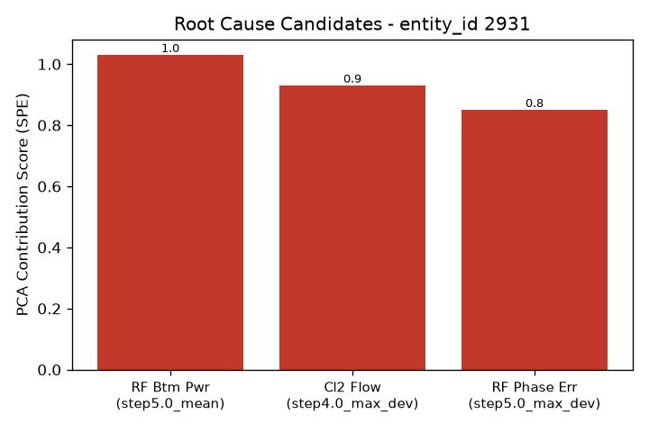

# 알람 조사 보고서 - entity_id 2931

- 생성 시각: 2026-09-11 23:03:11
- 사용 모델: us.anthropic.claude-sonnet-4-6 (AWS Bedrock)

모든 정보를 수집했습니다. 종합 보고서를 작성합니다.

---

# 이상 알람 조사 보고서
**장비:** LAM 9600 플라즈마 에칭 장비
**대상 웨이퍼:** entity_id **2931**
**작성 주체:** AI 보조 엔지니어 (최종 판단은 반드시 공정 엔지니어가 수행해야 합니다)

---

## 알람 요약

entity_id 2931번 웨이퍼에서 이상 알람이 발생하였습니다. PCA 기반 이상탐지 엔진을 통해 센서 데이터를 분석한 결과, 기여도(contribution score) 기준 상위 3개의 원인 후보 변수가 도출되었습니다. 아래 원인후보는 **확정된 원인이 아니며**, 공정 엔지니어의 현장 확인 및 최종 판단이 필요합니다.

---

## 원인후보 (근거 포함)

| 순위 | 변수명 | 세부 지표 | 기여도 점수 |
|------|--------|-----------|-------------|
| 1 | **RF Btm Pwr** | step5.0_mean (5단계 평균값 이상) | 1.03 |
| 2 | **Cl2 Flow** | step4.0_max_dev (4단계 최대 편차 이상) | 0.93 |
| 3 | **RF Phase Err** | step5.0_max_dev (5단계 최대 편차 이상) | 0.85 |

### 주목 포인트
- **1순위 RF Btm Pwr**는 기여도 1.03으로 가장 높으며, **step 5 구간의 평균값 자체**가 정상 범위를 벗어난 것으로 분석되었습니다. 지속적인 전력 레벨 이상이 의심됩니다.
- **2순위 Cl2 Flow**는 **step 4 구간의 최대 편차**가 비정상적으로 나타났습니다. 순간적인 유량 흔들림이 발생했을 가능성이 있습니다.
- **3순위 RF Phase Err**는 **step 5 구간의 위상 오차 최대 편차**가 비정상 수준으로, 1순위 RF Btm Pwr와 동일한 step에서 이상이 집중되어 있어 **바이어스 RF 전원계 계통 문제의 연관 가능성**에 유의가 필요합니다.

---

## 참고 배경지식 (AI 합성 지식, 검증 필요)

> ⚠️ **주의:** 아래 내용은 **AI가 일반 반도체 공정 지식을 기반으로 정리한 참고 정보**이며, **이 장비(LAM 9600)의 검증된 사내 매뉴얼이 아닙니다.** 반드시 사내 공식 문서와 교차 검토하시기 바랍니다.

### 🔴 RF Btm Pwr (바이어스 RF 전력)
- **역할:** 웨이퍼가 놓인 척(chuck) 쪽에 인가되는 전력으로, 이온이 웨이퍼 표면에 충돌하는 에너지(이온 바이어스)를 조절. TCP 전원계와는 독립된 전원계.
- **흔한 원인:** 바이어스 RF 발생기 이상, 척-웨이퍼 접촉 불량
- **증상:** 식각 선택비 및 프로파일(측벽 각도) 변화, 과도 전력 시 웨이퍼 손상 위험

### 🟡 Cl2 Flow (염소 가스 유량)
- **역할:** 알루미늄 등 금속 배선 식각을 위한 주 반응가스
- **흔한 원인:** MFC(질량유량제어기) 드리프트, 가스 배관 막힘 또는 누출
- **증상:** 식각 속도 및 선택비 변화. 유량 부족 시 식각 정지, 과다 시 언더컷 증가

### 🟠 RF Phase Err (바이어스 RF 위상 오차)
- **역할:** RF Btm Pwr와 동일 계통(바이어스 RF, 척 쪽)의 위상 오차 지표
- **흔한 원인:** 바이어스 RF 발생기 이상, 척-웨이퍼 접촉 불량
- **증상:** 식각 선택비·프로파일 변화, 과도 시 웨이퍼 손상 위험

---

## 다음 조치 제안 (공정 엔지니어 확인 필요)

> ⚠️ 아래 조치는 AI가 원인후보를 바탕으로 제안하는 참고 사항입니다. **최종 조치 결정은 반드시 공정 엔지니어가 현장 상태를 직접 확인 후 판단하십시오.**

1. **[우선순위 高] 바이어스 RF 전원계 점검**
   - RF Btm Pwr(1순위)와 RF Phase Err(3순위)가 모두 step 5 구간에서 이상 징후를 보이며, 동일 계통(바이어스 RF 발생기 및 척 연결부)에 해당합니다.
   - 바이어스 RF 발생기 출력 안정성, 매칭 네트워크 상태, 척-웨이퍼 접촉 상태를 우선 점검할 것을 제안합니다.

2. **[우선순위 中] Cl2 MFC 및 가스 배관 점검**
   - Cl2 Flow의 step 4 구간 최대 편차 이상은 MFC 드리프트나 가스 라인 이상일 가능성이 있습니다.
   - MFC 교정(calibration) 이력 확인 및 가스 배관 누출·막힘 여부를 점검할 것을 제안합니다.

3. **[공통] step 4~5 구간 로그 상세 분석**
   - 이상 신호가 step 4 및 step 5에 집중되어 있으므로, 해당 구간의 원시 센서 로그 데이터를 중점적으로 검토하시기 바랍니다.

4. **