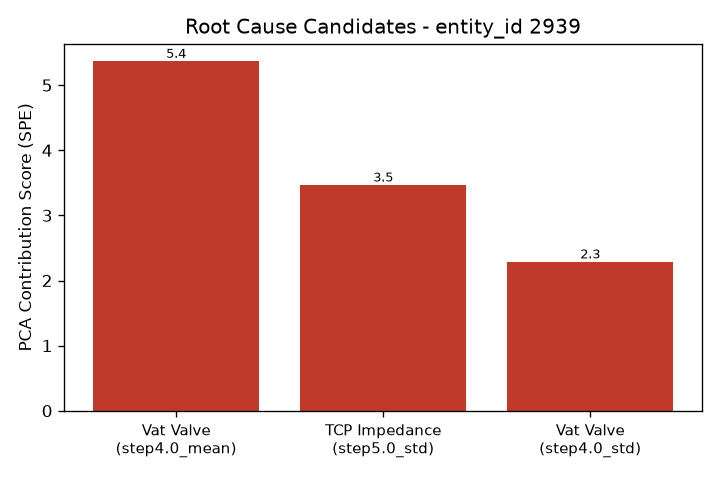

# 알람 조사 보고서 - entity_id 2939

- 생성 시각: 2026-09-11 23:02:18
- 사용 모델: us.anthropic.claude-sonnet-4-6 (AWS Bedrock)

모든 정보 수집이 완료되었습니다. 보고서를 작성합니다.

---

# LAM 9600 이상 알람 분석 보고서

> **장비:** LAM 9600 플라즈마 에칭 장비
> **분석 일시:** 2025년 7월 14일
> **담당:** AI 보조 엔지니어 (최종 판단은 공정 엔지니어 확인 필요)

---

## 알람 요약

| 항목 | 내용 |
|------|------|
| 웨이퍼 ID | **2939** |
| 탐지 방법 | PCA 기반 이상탐지 엔진 |
| 주요 이상 징후 | Step 4.0 및 Step 5.0 구간에서 복수 변수 이상 기여도 감지 |
| 상위 원인 후보 수 | 3개 (2개 변수 군) |

---

## 원인후보 (근거 포함)

> ⚠️ 아래는 **이상 기여도 점수 기반 후보**이며, 확정된 원인이 아닙니다. 최종 판단은 반드시 공정 엔지니어가 수행해야 합니다.

| 순위 | 변수 | 세부 항목 | 기여도 점수 | 해석 |
|------|------|-----------|------------|------|
| 1 | **Vat Valve** | step4.0_mean | 5.37 | Step 4.0 구간 평균값 이탈 → 압력 제어 이상 가능성 |
| 2 | **TCP Impedance** | step5.0_std | 3.47 | Step 5.0 구간 편차 증가 → 플라즈마 안정성 이상 가능성 |
| 3 | **Vat Valve** | step4.0_std | 2.29 | Step 4.0 구간 편차 증가 → Vat Valve 거동 불안정 가능성 |

**패턴 요약:**
- **Vat Valve**가 1위(기여도 5.37)와 3위(기여도 2.29)를 동시에 차지하여, Step 4.0 구간에서 **평균값 이탈과 변동성 증가가 함께 발생**한 것으로 분석됩니다.
- **TCP Impedance**는 Step 5.0에서 표준편차 이상이 감지되어 플라즈마 전력 공급 계통의 불안정 가능성이 있습니다.

---

## 참고 배경지식 (AI 합성 지식, 검증 필요)

> 🔴 **중요 고지:** 아래 내용은 AI가 정리한 일반 반도체 공정 지식입니다. **이 장비(LAM 9600)의 검증된 사내 매뉴얼이 아니며**, 실제 장비 사양 및 공정 조건과 다를 수 있습니다. 참고용으로만 활용하고, 반드시 공정 엔지니어가 검토해야 합니다.

### ✅ TCP Impedance — 참고 정보 확인됨

| 항목 | 내용 |
|------|------|
| **서브시스템** | TCP (Transformer Coupled Plasma) 계열 |
| **역할** | 챔버 상단 코일에 고주파 전력을 인가하여 플라즈마를 생성하고, 플라즈마 밀도 및 라디칼 생성량을 결정하는 핵심 시스템 |
| **흔한 원인** | RF 발생기 출력 드리프트, 임피던스 매칭 네트워크 튜닝 불량, 코일 노후화 |
| **주요 증상** | 식각 속도 변화, 웨이퍼 표면 균일도 저하, 전력 과잉 시 과식각 / 부족 시 식각 부족 |

### ❌ Vat Valve — 참고 정보 조회 실패

시스템에서 **Vat Valve 관련 배경 지식을 찾지 못했습니다.** 해당 변수의 역할, 흔한 원인, 증상 정보를 제공할 수 없습니다. 사내 장비 매뉴얼 또는 담당 엔지니어를 통해 직접 확인이 필요합니다.

---

## 다음 조치 제안 (공정 엔지니어 확인 필요)

> ⚠️ 아래 제안은 보조 AI의 참고용 제안이며, 실제 조치 여부와 순서는 공정 엔지니어의 전문적 판단에 따라야 합니다.

1. **[우선순위 1] Vat Valve 점검 (Step 4.0 구간 집중)**
   - 기여도 점수가 가장 높고(5.37), 평균 이탈과 표준편차 이상이 동시에 나타남
   - Vat Valve의 실제 개도(opening) 로그 및 응답 특성을 Step 4.0 구간에서 직접 확인 권장
   - 밸브 액추에이터 마모, 컨트롤러 신호 이상, 기계적 스틱-슬립 현상 여부 점검 고려

2. **[우선순위 2] TCP Impedance 점검 (Step 5.0 구간)**
   - Step 5.0 구간 편차 증가 → RF 발생기 출력 안정성 및 매칭 네트워크 상태 점검 권장
   - Vat Valve 이상으로 인한 압력 변동이 플라즈마 임피던스 불안정에 **연쇄적으로 영향을 미쳤을 가능성**도 검토 필요

3. **[추가 확인] 해당 스텝 전후 공정 이력 검토**
   - 2939번 웨이퍼 전후 웨이퍼의 공정 결과(식각률, CD, 균일도 등) 비교 분석 권장
   - 동일 챔버 내 다른 웨이퍼에서 유사 패턴 발생 여부 확인

4. **[참고] Vat Valve 관련 매뉴얼 직접 조회 필요**
   - 해당 변수의 배경 지식 데이터베이스 조회가 실패하였으므로, 반드시 **사내 장비